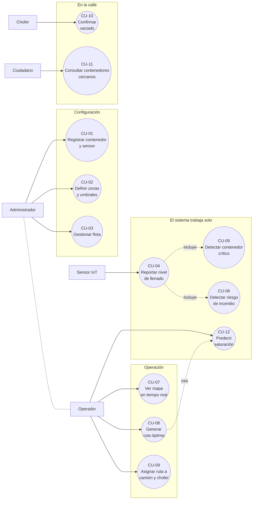
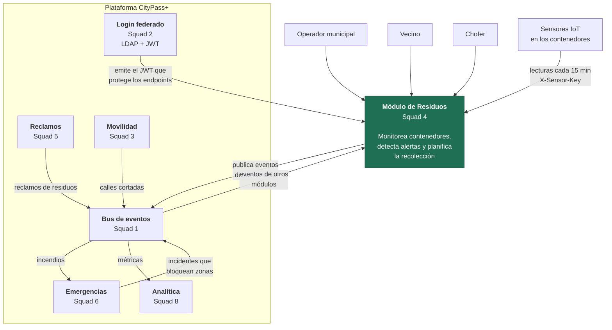
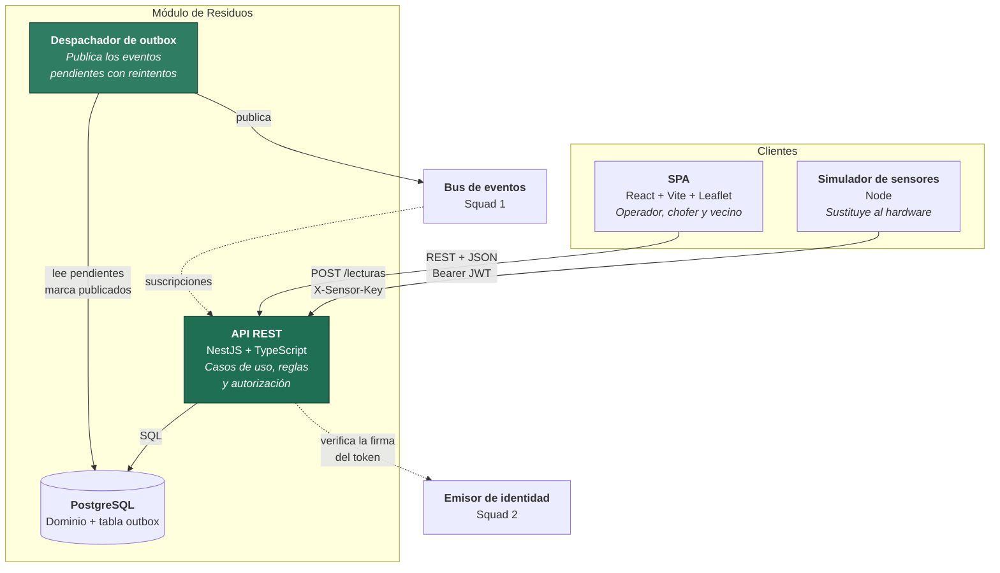
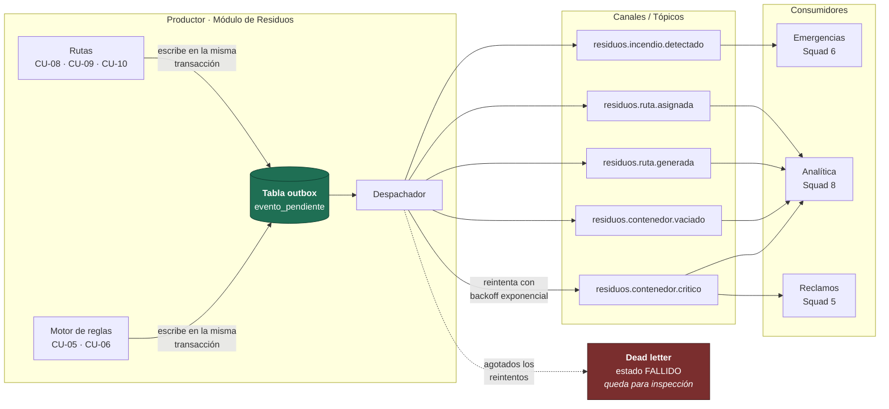
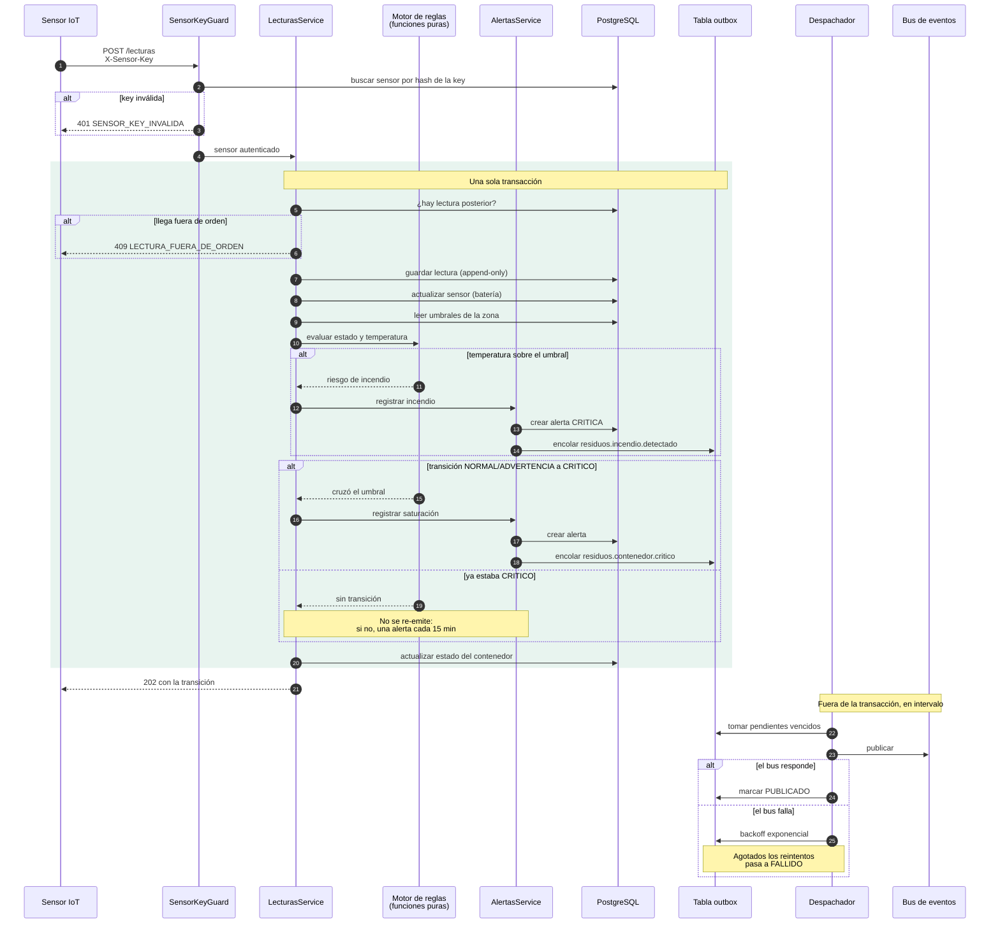
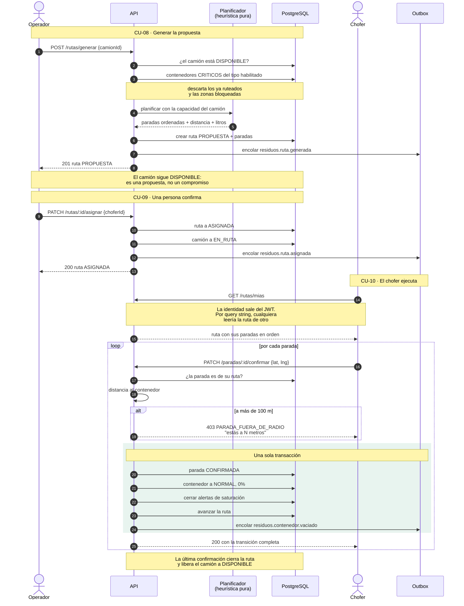
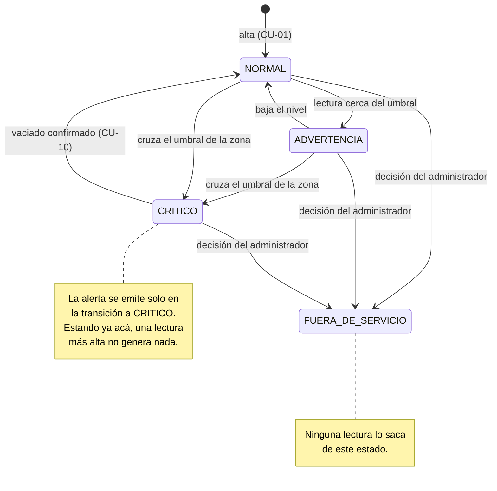
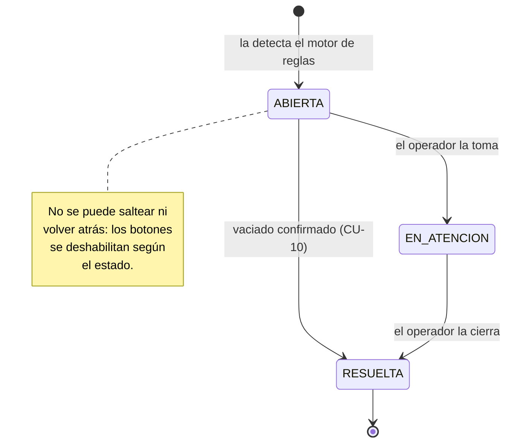
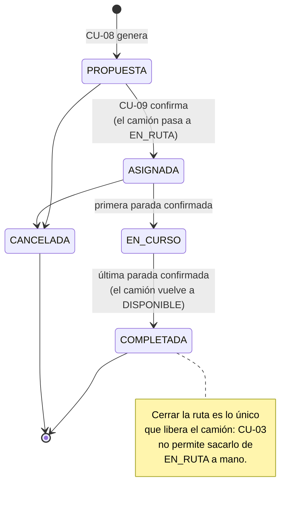

# Diagramas — Módulo de Gestión de Residuos Inteligente

**CityPass+ · Squad 4 · UADE, 2C 2026**

Todos los diagramas están en Mermaid dentro del repositorio, no como imágenes exportadas. La razón
es simple: un diagrama que vive en un archivo aparte miente a las dos semanas. Estos se editan en
el mismo commit que el código que describen, y GitHub los renderiza solo.

| Diagrama | Qué muestra |
|---|---|
| [1. Casos de uso](#1-diagrama-de-casos-de-uso) | Los 12 CU y sus actores |
| [2. Contexto (C4 nivel 1)](#2-contexto--c4-nivel-1) | El módulo dentro de CityPass+ |
| [3. Contenedores (C4 nivel 2)](#3-contenedores--c4-nivel-2) | Las piezas internas del módulo |
| [4. Arquitectura de eventos](#4-arquitectura-de-eventos) | Productores, canales y consumidores |
| [5. Secuencia: ingesta y detección](#5-secuencia--ingesta-y-detección-cu-04-cu-05-cu-06) | CU-04, CU-05, CU-06 |
| [6. Secuencia: ciclo de recolección](#6-secuencia--ciclo-de-recolección-cu-08-cu-09-cu-10) | CU-08, CU-09, CU-10 |
| [7. Máquinas de estado](#7-máquinas-de-estado) | Contenedor, alerta y ruta |
| [Entidad-relación](modelo-de-datos.md) | En su propio documento, junto al modelo |

---

## 1. Diagrama de casos de uso

Doce casos de uso y cinco actores. **El sensor es un actor no humano**: se autentica con una API
key y no con una sesión de usuario, y es el único que dispara casos de uso sin que haya nadie
apretando un botón.

**Dos relaciones que vale leer con atención:**

- **CU-04 incluye CU-05 y CU-06.** Cada lectura que entra dispara la evaluación de ambas reglas.
  No son casos de uso que alguien invoque: ocurren como consecuencia de la ingesta.
- **CU-08 usa CU-12.** El ruteo considera los contenedores críticos de hoy más los que la
  predicción indica que van a cruzar el umbral durante el turno.

---

## 2. Contexto — C4 nivel 1

Dónde vive nuestro módulo dentro de la plataforma, y con quién habla.

> **Las flechas hacia el bus son punteadas en el tiempo, no en el espacio.** Nada de lo que
> publicamos espera respuesta: el módulo sigue funcionando aunque Emergencias esté caído. Eso es
> justamente lo que compra el asincronismo, y es lo que el diagrama sincrónico equivalente no
> podría mostrar sin cadenas de dependencia entre todos los squads.

---

## 3. Contenedores — C4 nivel 2

Las piezas internas y cómo se comunican.

**Por qué el despachador es una pieza aparte y no una función más de la API:** porque publicar y
atender requests son dos ritmos distintos. La API responde en milisegundos; el despachador
reintenta con backoff durante minutos si el bus está caído. Mezclarlos haría que una falla del
broker se sintiera como lentitud de la API.

---

## 4. Arquitectura de eventos

En el vocabulario de la Unidad 03: **productor**, **canal / tópico**, **consumidor**.

### Por qué la tabla outbox está en el medio

La Unidad 03 nombra entre los beneficios de la comunicación asincrónica los de **reprocesar**
—"dotar de un mecanismo para que se procesen los mensajes enviados"— y **fallas** —"puedo
almacenar los mensajes que fueron fallidos para hacer algo"—. La tabla outbox es exactamente eso,
implementado.

El evento se escribe en la base **dentro de la misma transacción** que el cambio de negocio que lo
origina. Eso da dos garantías que publicar directo contra el broker no puede dar:

- **Si el broker está caído, el evento no se pierde.** Queda pendiente y se reintenta.
- **Si la transacción de negocio falla, el evento no se publica.** No existe el caso de un
  contenedor que "se marcó crítico" según el bus pero no según la base.

Y lo que el módulo publica **no espera respuesta de nadie**: es lo que evita los seis problemas que
la unidad enumera para lo sincrónico —bloqueo, latencia, dependencia, acoplamiento, complejidad y
volumen—. Emergencias puede estar caído y nuestra ingesta sigue andando.

### Eventos a los que nos suscribimos

| Canal | Squad | Qué hacemos al recibirlo |
|---|---|---|
| `emergencias.incidente.creado` | 6 | Bloqueamos la zona: sus contenedores quedan fuera del ruteo |
| `movilidad.calle.cortada` | 3 | Se excluye el tramo del cálculo de ruta |
| `reclamos.creado` | 5 | Si es de residuos, sube la prioridad del contenedor |

> Los nombres de estos tres son **supuestos**, derivados de la descripción de cada módulo en el
> enunciado. Hay que confirmarlos con cada squad. Ver
> [contratos-de-eventos.md](contratos-de-eventos.md).

---

## 5. Secuencia — ingesta y detección (CU-04, CU-05, CU-06)

El camino crítico del módulo: una lectura entra y todo lo demás ocurre como consecuencia.

**Lo que este diagrama explica mejor que cualquier texto:** por qué la publicación está *fuera* del
recuadro de la transacción. Si estuviera adentro, una caída del bus revertiría la lectura y el
contenedor no quedaría marcado crítico. La transacción de negocio no puede depender de que un
tercero esté vivo.

---

## 6. Secuencia — ciclo de recolección (CU-08, CU-09, CU-10)

De contenedor saturado a contenedor vaciado. Es la historia que cuenta la demo.

**Por qué generar y asignar están separados:** la heurística propone y una persona confirma. Es el
único momento en que alguien puede notar que la propuesta es absurda, y por eso el recorrido, el
orden y la carga se ven *antes* del botón.

---

## 7. Máquinas de estado

### Contenedor

### Alerta

### Ruta

---

## Documentos relacionados

| Documento | Qué tiene |
|---|---|
| [modelo-de-datos.md](modelo-de-datos.md) | Diagrama entidad-relación y decisiones de modelado |
| [contratos-de-eventos.md](contratos-de-eventos.md) | Sobre común, payloads y política de reintentos |
| [guia-frontend.md](guia-frontend.md) | Contratos de cada endpoint con capturas reales |
| [../adr/](../adr/) | Las decisiones de arquitectura, con las opciones descartadas |
