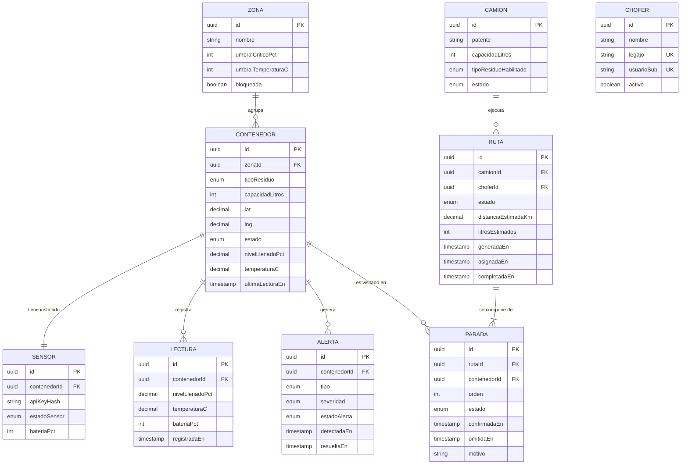

# Modelo de datos — Squad 4 · Residuos

PostgreSQL 16 + TypeORM. Ver [ADR-002](../adr/ADR-002-persistencia.md).

## Diagrama entidad-relación



## Enumeraciones

| Enum | Valores |
|---|---|
| `TipoResiduo` | `COMUN`, `RECICLABLE`, `ORGANICO` |
| `EstadoContenedor` | `NORMAL` (verde), `ADVERTENCIA` (amarillo), `CRITICO` (rojo), `FUERA_DE_SERVICIO` |
| `EstadoSensor` | `ACTIVO`, `SIN_SENAL`, `BATERIA_BAJA`, `INACTIVO` |
| `TipoAlerta` | `SATURACION`, `INCENDIO`, `SENSOR_CAIDO`, `BATERIA_BAJA` |
| `Severidad` | `BAJA`, `MEDIA`, `ALTA`, `CRITICA` |
| `EstadoAlerta` | `ABIERTA`, `EN_ATENCION`, `RESUELTA` |
| `EstadoCamion` | `DISPONIBLE`, `EN_RUTA`, `MANTENIMIENTO` |
| `EstadoRuta` | `PROPUESTA`, `ASIGNADA`, `EN_CURSO`, `COMPLETADA`, `CANCELADA` |
| `EstadoParada` | `PENDIENTE`, `CONFIRMADA`, `OMITIDA` |

## Decisiones de modelado

**Ultima lectura desnormalizada en `CONTENEDOR`.** Los campos `estado`, `nivelLlenadoPct` y
`temperaturaC` duplican la ultima fila de `LECTURA`. Es deliberado, y por la misma razon que el
estado: el mapa de CU-07 y el listado de contenedores tienen que responder sin hacer JOIN contra
una tabla que crece ~48.000 filas por dia.

**Estado derivado y persistido a la vez.** `CONTENEDOR.estado` podría calcularse siempre desde la
última lectura, pero se persiste igual. Dos razones: el mapa de CU-07 necesita responder rápido sin
un JOIN contra una tabla de lecturas que crece sin freno, y CU-05 necesita conocer el estado
*anterior* para no re-emitir el evento cuando el contenedor ya estaba crítico.

**`LECTURA` es append-only.** Nunca se actualiza ni se borra. Es la fuente de verdad histórica y el
insumo del modelo predictivo de CU-12. Con 500 contenedores reportando cada 15 minutos crece a
~48.000 filas diarias, así que lleva índice compuesto:

```sql
CREATE INDEX idx_lectura_contenedor_fecha ON lectura (contenedor_id, registrada_en DESC);
```

Ese índice sirve a los dos accesos calientes: "última lectura de este contenedor" (CU-05, CU-07) y
"últimas N lecturas de este contenedor" (CU-12).

**`ALERTA` se separa de `CONTENEDOR`.** Un contenedor puede tener varias alertas simultáneas de
distinto tipo (saturado y con batería baja a la vez) y necesitamos su ciclo de vida propio
(abierta → en atención → resuelta) para el tablero del operador.

**`SENSOR` es entidad aparte aunque la relación sea 1:1.** El sensor tiene ciclo de vida propio:
se rompe, se reemplaza, se recalibra. Además guarda su `apiKeyHash`, que es una credencial y no
debe convivir con datos de ubicación pública ([ADR-005](../adr/ADR-005-seguridad-identidad.md)).

**`RUTA.choferId` es una clave foránea a `CHOFER`.** Durante los primeros sprints fue texto libre,
bajo el supuesto de que los choferes eran usuarios del módulo de identidad del Squad 2 y que
mantener una copia acá solo se desincronizaría. Ese supuesto cambió: los choferes son entidades de
este módulo, no se registran ni inician sesión contra el Squad 2.

El costo de que fuera texto libre era concreto: nadie validaba nada, así que un identificador mal
tipeado asignaba la ruta **con éxito** y el chofer no la veía nunca.

`CHOFER.usuarioSub` es lo único que une a la persona con su sesión: `GET /rutas/mias` resuelve por
ahí. Es nullable porque un chofer puede existir en la operación antes de que alguien le configure
el acceso.

**Preparado para los alcances completos.** `ZONA` puede recibir una columna `geometry` (PostGIS)
sin migrar datos si algún día se implementa CU-02 completo, y `PARADA.confirmadaEn` ya contempla
la marca temporal que necesitaría una cola offline de CU-10.
